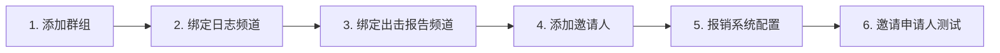

# BC-CY-Bot 搭建文档

> 适用版本：**v1.0.0-beta.2**
> 适用读者：第一次部署 BC-CY-Bot 的运维 / DevOps / 主理人
> 预计耗时：30–60 分钟（取决于服务器准备时间）

本文档覆盖**从零到生产可用**的全部步骤。如果你只是要升级旧版本，跳到 [§9 升级流程](#9-升级流程)。

---

## 0. 速览：你需要准备的东西

| 项 | 要求 |
|---|---|
| 服务器 | 任意一台可访问公网的 Linux 主机（1 vCPU / 1 GB 内存起步即可），推荐 Ubuntu 22.04+ |
| Docker | `docker` ≥ 24，`docker compose` v2 |
| Telegram | 1 个 Bot Token（@BotFather）+ 你的 Telegram 数字 ID |
| 目标群 | 1 个 Bot 已被设为管理员的私密群组 |
| 日志 / 出击报告频道（可选） | Bot 主动写入：6 类事件卡片 + 出击报告归档，各 1 个 |
| 对外广播频道（可选） | 运营自己发内容；如启用报销，**用户必须订阅这些频道才能领报销**，常见 1–3 个 |
| 报销资格群（可选） | 同样作为报销资格成员校验的目标，常见 1+ 个 |
| 域名 | 不需要（Polling 模式，无需 webhook，无需公网入站端口） |

---

## 1. Telegram 侧准备

### 1.1 创建 Bot 并获取 Token

1. Telegram 私聊 [@BotFather](https://t.me/BotFather) → 发 `/newbot`
2. 输入 Bot 显示名（任意）→ 输入 username（必须以 `bot` 结尾，全局唯一）
3. 收到形如 `123456789:AAH...` 的 Token → 妥善保存（这是后面 `.env` 里要用的 `BOT_TOKEN`）
4. 顺手把 Bot 的隐私模式关掉，方便后续群操作：发 `/setprivacy` → 选刚才的 Bot → `Disable`

### 1.2 获取你的 Telegram 数字 ID

1. 私聊 [@userinfobot](https://t.me/userinfobot) → 它会直接回复你的 `id`（一串数字）
2. 保存这个 ID —— 这是后面 `INITIAL_SUPER_ADMIN_ID`

### 1.3 准备目标群组

1. 新建一个**私密**群组（不要"公开链接"型，因为本系统颁发的是一次性邀请链接）
2. 把刚创建的 Bot 加进群
3. 群设置 → 管理员 → 添加 Bot 为管理员，**至少勾选**这两项：
   - ✅ Invite Users via Link（邀请用户）
   - ✅ Ban Users（封禁用户 —— 注销账号清理需要）
   - 其他不勾也行
4. 记下群的 telegram_chat_id（首次启动后会通过"转发群里任一条消息给 Bot"来识别，**这里不需要预先记**）

### 1.4 准备所有相关频道

本系统涉及 **4 类频道**，按用途分两组：

**A. Bot 主动写入的内部频道（运营管理用，可选但强烈推荐）**

| 频道 | 用途 | Bot 权限要求 |
|---|---|---|
| 日志频道 | 6 类事件卡片：新申请 / 通过 / 拒绝 / 链接已用 / 链接过期 / 密钥使用 / 报销 5 状态 | 管理员 + Post Messages |
| 出击报告频道 | 仅转发申请人提交的"出击报告"文本，归档用 | 管理员 + Post Messages |

**B. 面向大众的广播频道（运营自己发内容，Bot 只校验成员身份）**

| 频道 | 用途 | Bot 权限要求 |
|---|---|---|
| 广播频道 #1 | 运营对外发布课程通知等，**报销资格强制订阅** | 管理员（仅为了 `getChatMember` 能查到成员状态）|
| 广播频道 #2 | 同上（如有多个则按此模式追加）| 同上 |

> ⚠️ **关键设计**：用户必须**同时**是所有"资格条目"（含广播频道 + 报销资格群）的成员，才能申请报销 —— AND 语义，缺一不可。这是 [REQUIREMENTS §8.5.7] 的硬约束。

#### 每个频道的通用配置步骤

1. 新建一个频道（私有/公开按运营需要）
2. 把 Bot 添加为管理员
3. A 类（日志/出击报告）勾选 **Post Messages**；B 类（广播）不需要 Post 权限，仅作为成员名册让 Bot 能 `getChatMember`
4. 不需要预先记 chat_id —— 后续在 `/admin` 面板里转发该频道任一条消息即可识别绑定

> 💡 **为什么 B 类也要把 Bot 设为管理员？** 对私有频道，Bot 必须是管理员才能查 `getChatMember`。如果是公开频道，普通成员身份也行，但管理员最稳妥。

---

## 2. 服务器侧准备

### 2.1 安装 Docker（如果还没装）

Ubuntu 22.04 / 24.04 示例：

```bash
# 卸载冲突包
sudo apt-get remove docker docker-engine docker.io containerd runc

# 安装 docker + docker compose plugin
curl -fsSL https://get.docker.com | sh
sudo usermod -aG docker $USER     # 让当前用户能跑 docker 不需要 sudo
newgrp docker                     # 立即生效（或者重新登录）

# 验证
docker --version
docker compose version
```

### 2.2 防火墙（如有）

Bot 用 **Polling 模式**，不需要开放任何入站端口。出站只需要 HTTPS 到 `api.telegram.org`，几乎所有云服务器默认放行。

如果你用云厂商的安全组，确认 **TCP 出站 443 放行**即可。

---

## 3. 拉代码 + 配置

### 3.1 克隆仓库

```bash
cd /opt                              # 或任何你喜欢的目录
sudo git clone https://github.com/ARi1059/BC-CY-Bot.git
sudo chown -R $USER:$USER BC-CY-Bot  # 让当前用户拥有
cd BC-CY-Bot
git checkout v1.0.0-beta.2           # 锁到当前最新 Beta
```

### 3.2 编写 `.env`

```bash
cp .env.example .env
nano .env
```

填入这 4 个值：

```dotenv
# 必填
BOT_TOKEN=123456789:AAH................（§1.1 拿到的）
INITIAL_SUPER_ADMIN_ID=987654321        （§1.2 拿到的数字 ID）
POSTGRES_PASSWORD=$(openssl rand -base64 24 | tr -d /=+)   # 用强密码替换

# 可选（保留默认即可）
LOG_LEVEL=INFO
TIMEZONE=Asia/Shanghai
```

`.env` 已在 `.gitignore` 中排除，不会被 Git 跟踪。

> 💡 `POSTGRES_PASSWORD` 仅在 docker-compose 创建数据库容器时使用。生产环境一定要改强密码。

### 3.3 检查 `docker-compose.yml`（一般不需要改）

```yaml
services:
  postgres:    # PostgreSQL 15
  bot:         # 你的 Bot 容器
```

`bot` 服务的 `DATABASE_URL` 环境变量在 compose 文件里**已经写死**为内部 PostgreSQL 连接串，会**覆盖**你 `.env` 里的 `DATABASE_URL`。这是有意为之 —— 防止本地开发用的 SQLite URL 误进生产。

---

## 4. 首次启动

### 4.1 构建 + 启动

```bash
docker compose up -d --build
```

第一次会拉镜像 + 构建 Bot 镜像，需要 2–5 分钟。

### 4.2 看日志确认成功

```bash
docker compose logs -f bot
```

等待出现这两行：

```
INFO  alembic.runtime.migration Running upgrade ... -> a1b2c3d4e5f6, add inviter reimbursement tier
INFO  bccy_bot.bot  super_admin_ensured action=created admin_id=987654321
```

看到这两行 = 成功。`Ctrl+C` 退出日志流（容器还在跑）。

### 4.3 验证 Bot 在线

| 步骤 | 预期 |
|---|---|
| 在 Telegram 私聊你的 Bot，发 `/start` | 收到欢迎卡片，含 `[🚀 开始申请入群]` `[🔑 使用回群密钥]` `[💰 申请报销]` 按钮 |
| 用 §1.2 那个超管账号私聊 Bot，发 `/admin` | 收到管理面板，含 `[⚙️ 系统配置]`（普通管理员看不到这个） |

如果两条都通过 → Bot 已上线，去 §5 开始配置。

如果失败 → 看 §10 排错。

---

## 5. 首次配置（管理员侧）

按这个顺序在 Telegram 里完成所有初始化。每一步都对应面板上的一个按钮，没有命令行操作。



### 5.1 添加目标群组

1. `/admin` → `[👥 群组管理]` → `[➕ 添加群组]`
2. 把 §1.3 那个目标群里任意一条消息**转发**给 Bot
3. Bot 识别 `chat_id` 后回复"群组已添加"

### 5.2 绑定日志频道

1. `/admin` → `[📡 日志频道]` → `[➕ 绑定频道]`
2. 把 §1.4 日志频道里任意一条消息转发给 Bot
3. 看到"已绑定"

### 5.3 绑定出击报告频道

同 5.2，入口是 `[📋 出击报告频道]`。

### 5.4 添加第 1 个邀请人

`/admin` → `[🎓 邀请人管理]` → `[➕ 添加邀请人]`，按 7 步引导：

| 步骤 | 操作 |
|---|---|
| 1/7 | 发送邀请人的 Telegram 数字 ID（让对方私聊 @userinfobot 拿）；或 `/skip` 表示挂名 |
| 2/7 | 发送显示名（如 "张老师"） |
| 3/7 | 发送组别名（如 "A组"） |
| 4/7 | 从按钮中选择目标群组 |
| 5/7 | 多选所需材料（约课记录 / 上课手势 / 出击报告） |
| 6/7 | 选审核模式：👤 自审型 / 🏢 代审型 |
| 7/7 | 选报销档位：💰 100 / 150 / 200 元 |

最后确认创建。

> 💡 自审型 = 邀请人本人审核自己引荐的申请人；代审型 = 所有管理员都能审核（先到先得）。如果是"挂名"邀请人（步骤 1 选 /skip），只能用代审型。

### 5.5 配置报销系统（如不需要报销可跳过）

#### 5.5.1 系统配置

`/admin` → `[💰 报销管理]` → `[📋 系统配置]`：

1. `[▶️ 开启总开关]`
2. `[✏️ 设置月预算]` → 发 `5000` 表示 5000 元
3. `[♻️ 重置当前月余额至月预算]` → 同步月剩余
4. `[✏️ 设置冷却天数]` 默认 7 天，按需调
5. `[✏️ 设置预算重置日]` 默认每月 1 号

> ⚠️ 金额不在这里设了 —— 每个邀请人的档位（100/150/200）已经在 §5.4 步骤 7 配过。修改某邀请人档位：进 `[🎓 邀请人管理]` → 该邀请人那行的 `[💰 调档位]`。

#### 5.5.2 资格列表（含广播频道 + 资格群，AND 语义）

回到 `[💰 报销管理]` → `[🎯 资格列表]` → `[➕ 添加资格群/频道]`，依次添加：

| 类型 | 来源 | 操作 |
|---|---|---|
| 广播频道 #1 | §1.4 中的对外广播频道 | 转发该频道任一条消息给 Bot |
| 广播频道 #2 | 同上 | 同上 |
| 报销资格群 | 运营内部讨论群 / 学员群 等 | 转发该群任一条消息给 Bot |

> 🚨 **AND 语义提醒**：用户必须**同时**是上面**所有**条目的成员才能申请报销。哪怕只有 1 个广播频道用户没订阅，`/reimburse` 也会被拒绝（提示"您不符合报销资格"）。
>
> 这是有意为之 —— 报销是对"持续关注"的回馈，缺一项即视为不达标。如果你想放宽某些群组，可以在面板里把对应条目"停用"（保留记录但不参与校验）。

#### 5.5.3 验证

用一个测试账号（**未**订阅广播频道）发 `/reimburse` → 应看到 `⚠️ 您不符合报销资格`。
让该账号订阅所有广播频道 + 加入资格群后再发 `/reimburse` → 应能进入 wizard。

> 💡 资格校验有 5 分钟缓存（成功结果），失败不缓存 —— 用户加群后下次 `/reimburse` 立即生效。

### 5.6 跑一次完整 E2E

最简单的烟测试：

1. 准备一个**测试账号**（不是超管，不是邀请人）
2. 测试账号私聊 Bot，发 `/start` → `[🚀 开始申请入群]` → 选张老师 → 走完 wizard 提交
3. 切到张老师账号 → 收到审核双消息 → 点 `[✅ 通过]`
4. 测试账号收到一次性入群链接 → 点进群
5. 回到日志频道看 6 类事件卡片是否到位

走通 = 系统可用。详细 E2E 清单见 [TESTING.md](TESTING.md)。

---

## 6. 备份策略

### 6.1 手动备份

```bash
docker compose exec -T postgres pg_dump -U bccy bccy | gzip > backup-$(date +%F).sql.gz
```

文件大小通常 < 1 MB（除非邀请人/申请人量级很大）。

### 6.2 自动每日备份（cron）

```bash
mkdir -p /opt/BC-CY-Bot/backups
crontab -e
```

加入：

```cron
0 3 * * * cd /opt/BC-CY-Bot && docker compose exec -T postgres pg_dump -U bccy bccy | gzip > backups/backup-$(date +\%F).sql.gz && find backups -name "backup-*.sql.gz" -mtime +30 -delete
```

凌晨 3 点备份，保留 30 天。

### 6.3 恢复

```bash
docker compose stop bot                  # 先停 Bot 避免写冲突
gunzip -c backup-2026-05-12.sql.gz | docker compose exec -T postgres psql -U bccy bccy
docker compose start bot
```

---

## 7. 监控与日志

### 7.1 日志查看

```bash
docker compose logs -f bot         # 实时
docker compose logs --tail=200 bot # 最近 200 行
docker compose logs bot | grep ERROR
```

日志为结构化 JSON（structlog），关键字段：`event`、`user_id`、`application_id`、`reimbursement_id`、`reviewer_id`。

### 7.2 健康检查

Bot 是 Polling 模式 + `restart: always`，崩了自己拉起。如果你想主动看状态：

```bash
docker compose ps           # bot 应该是 "Up" 状态
docker compose top bot      # 看进程
```

### 7.3 数据库直查（应急）

```bash
docker compose exec postgres psql -U bccy bccy
# \dt 看所有表
# SELECT * FROM admins;
# SELECT * FROM reimbursement_requests WHERE status='pending';
```

---

## 8. 安全建议

| 项 | 建议 |
|---|---|
| `.env` 权限 | `chmod 600 .env`，仅当前用户可读 |
| `POSTGRES_PASSWORD` | 强密码，仅在 `.env` 中保存；不要写进 docker-compose.yml |
| 数据库不暴露 | docker-compose.yml 默认不 publish PostgreSQL 端口，外网无法连 |
| Bot Token | 同对待 root 密码：泄露 = 全权控制你的 Bot；泄露后立即 `/revoke` @BotFather 重新生成 |
| 备份加密 | `gpg -c backup.sql.gz`，密钥与服务器分离存储 |
| 超管账号 | 多准备 2–3 个备用账号，写进文档自己保存（不要进入仓库） |

---

## 9. 升级流程

```bash
cd /opt/BC-CY-Bot
git fetch --tags
git checkout v1.0.0-beta.2       # 或下一个版本号
docker compose build bot
docker compose up -d bot         # 重启 Bot 容器；PostgreSQL 保持不动
docker compose logs -f bot       # 等 alembic upgrade head + super_admin_ensured
```

每个版本的 schema 变更会自动 `alembic upgrade head`。

> ⚠️ 跨大版本升级（v1.x → v2.x）前一定先备份（§6）。

---

## 10. 故障排查

### 10.1 Bot 启动后没收到任何消息

| 检查 | 命令 |
|---|---|
| 容器是否在跑 | `docker compose ps` → bot 必须 "Up" |
| Token 是否正确 | 日志里搜 "Unauthorized"，搜到 = Token 错 |
| 网络是否可达 Telegram | `docker compose exec bot curl -sI https://api.telegram.org` 应返 200 |

### 10.2 `super_admin_ensured` 没出现

- 看日志是否有 `alembic` 报错 —— 大概率是 PostgreSQL 没起来
- `docker compose logs postgres` 看数据库日志
- 极端情况：进数据库手动检查 `admins` 表

### 10.3 一次性链接颁发失败

| 现象 | 原因 |
|---|---|
| "无法创建邀请链接" | Bot 在目标群没有"邀请用户"权限 → 群设置补权限 |
| 链接生成但用户进不去 | 链接过期了（默认 24h），或者用户用了又退（一次性，用过即作废）|

### 10.4 报销发不出去

| 现象 | 原因 |
|---|---|
| 用户发 `/reimburse` 收到"未启用" | 总开关没开（`[💰 报销管理] → [📋 系统配置] → [▶️ 开启总开关]`）|
| "月预算未设" | 月预算 = 0，去配置面板设置 |
| "该入群申请缺少邀请人信息" | 该申请人的 application.inviter_id = NULL，数据异常 → 联系开发 |
| 审核者粘贴口令后 5 分钟没反应 | 状态超时；让审核者点 `[💸 待付款]` → `[💸 补发口令]` 重置等待态 |

### 10.5 应急换超管（原账号丢失/被封）

1. SSH 登录服务器，编辑 `.env`，把 `INITIAL_SUPER_ADMIN_ID` 改成**新超管的 Telegram 数字 ID**
2. `docker compose restart bot`
3. 看日志：会出现 `super_admin_ensured action=override_super_admin`
4. 原超管自动降级为副管理员；新 ID 升为超管

详细机制见 [REQUIREMENTS.md §4.6](REQUIREMENTS.md)。

### 10.6 完全重建（保留数据）

```bash
docker compose down                              # 停所有容器，保留 volume
docker compose pull                               # 拉镜像（如果你切了 tag）
docker compose up -d --build
```

### 10.7 完全清空（**会丢数据**，仅开发/测试）

```bash
docker compose down -v       # -v 删 volume = 删数据库
```

---

## 11. 相关文档

- [README.md](README.md) — 项目总览
- [OPERATIONS.md](OPERATIONS.md) — 所有业务流程操作手册（含流程图）
- [TESTING.md](TESTING.md) — 上线 E2E 联调清单
- [REQUIREMENTS.md](REQUIREMENTS.md) — 完整需求规格
- [CHANGELOG.md](CHANGELOG.md) — 版本变更
