# BC-CY-Bot 操作手册

> 适用版本：**v1.0.0-beta.2**
> 适用读者：超级管理员 / 副管理员 / 邀请人 / 申请人
> 配套文档：[搭建文档](DEPLOYMENT.md) · [需求规格](REQUIREMENTS.md) · [E2E 测试清单](TESTING.md)

本手册按角色组织：每个角色能做的事 + 流程图 + 关键决策路径 + 排错。所有流程图均为 Mermaid 语法，GitHub / VSCode 原生渲染。

---

## 目录

- [§0 角色与权限矩阵](#0-角色与权限矩阵)
- [§1 系统总览](#1-系统总览)
- **入群审核（v1）**
  - [§2 申请人 · 入群申请](#2-申请人--入群申请)
  - [§3 邀请人 · 自审型审核](#3-邀请人--自审型审核)
  - [§4 管理员 · 代审型审核](#4-管理员--代审型审核)
  - [§5 一次性链接 · 生命周期](#5-一次性链接--生命周期)
  - [§6 异常入群 · chat_member 监听](#6-异常入群--chat_member-监听)
  - [§7 用户 · 回群密钥救济](#7-用户--回群密钥救济)
- **报销系统（v2）**
  - [§8 申请人 · 报销申请](#8-申请人--报销申请)
  - [§9 管理员 · 报销审核 + 红包转发](#9-管理员--报销审核--红包转发)
  - [§10 月预算 + 周报/月报](#10-月预算--周报月报)
- **管理员后台**
  - [§11 系统初始化清单](#11-系统初始化清单)
  - [§12 邀请人管理](#12-邀请人管理)
  - [§13 黑名单](#13-黑名单)
  - [§14 频道绑定](#14-频道绑定)
  - [§15 主/副管理员管理 + 超管转让](#15-主副管理员管理--超管转让)
  - [§16 应急换超管](#16-应急换超管)
  - [§17 邀请人 · 个人面板 /panel](#17-邀请人--个人面板-panel)
- [§18 状态码与术语](#18-状态码与术语)

---

## §0 角色与权限矩阵

| 角色 | 标识 | 主要能力 |
|---|---|---|
| 申请人 | 普通用户 | `/start` 申请入群、`/reimburse` 申请报销、`/start` 使用回群密钥 |
| 邀请人 | `inviters.telegram_user_id` 命中 | `/panel` 看个人接单统计；自审型还能审核自己引荐的申请 |
| 副管理员 | `admins.role='sub'` | `/admin` 全部读 + 大部分写；**不能改系统配置、不能任命/转让超管** |
| 超级管理员 | `admins.role='super'`（全局唯一） | 全部权限，包括系统配置、邀请人/群组管理、报销系统配置、任命副管理员、转让超管 |

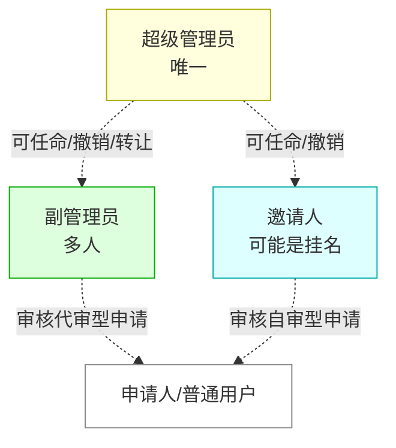

---

## §1 系统总览

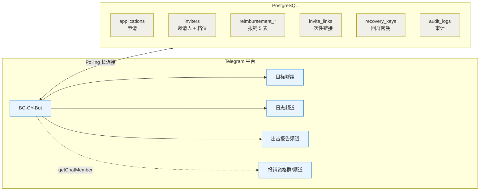

**关键设计原则**：
- **零命令记忆**：所有用户/管理员操作通过 Inline 按钮完成，命令仅做入口（`/start`、`/admin`、`/panel`、`/reimburse`）
- **严格状态机**：每个流程用 DB 字段（`status` / `wizard_step`）做单一真相源，进程重启不丢状态
- **审计完整**：所有写操作落 `audit_logs`，含 actor / action / target / details / created_at

---

## §2 申请人 · 入群申请

申请人是普通 Telegram 用户，从私聊 Bot 发 `/start` 开始。

```mermaid
flowchart TD
  Start[/用户私聊 Bot 发 /start/] --> WelcomeCard[Bot: 欢迎卡片<br/>3 按钮]
  WelcomeCard --> ClickApply[点 🚀 开始申请入群]
  ClickApply --> Blacklist{在黑名单?}
  Blacklist -->|是| Silent[静默拒绝<br/>不提示]
  Blacklist -->|否| ShowInviters[显示活跃邀请人列表]
  ShowInviters --> PickInviter[用户选一位邀请人]
  PickInviter --> Wizard1["wizard_step=1<br/>提示提交第 1 项材料"]

  Wizard1 --> SubmitOne[用户上传 1 张图 / 文本]
  SubmitOne --> Validate{校验}
  Validate -->|媒体组打包| Reject1["拒绝: 请单张提交"]
  Validate -->|类型错配<br/>该图却传文本| Reject2["拒绝: 请上传图片"]
  Validate -->|通过| AdvanceStep["wizard_step++"]
  Reject1 --> Wizard1
  Reject2 --> Wizard1

  AdvanceStep --> CheckLast{是最后一项?}
  CheckLast -->|否| NextStep[提示下一项]
  NextStep --> SubmitOne
  CheckLast -->|是| Preview["wizard_step=N+1<br/>预览卡片"]

  Preview --> UserChoice{用户选择}
  UserChoice -->|✏️ 重新提交| ClearMats[清空所有材料<br/>step=1]
  UserChoice -->|« 上一步| BackOne[删最后一项<br/>step--]
  UserChoice -->|❌ 取消| Cancel["status='cancelled'<br/>清空材料"]
  UserChoice -->|✅ 确认提交| Submit["status='pending'<br/>submitted_at=now"]

  ClearMats --> Wizard1
  BackOne --> SubmitOne
  Submit --> NotifyReviewers[notify_reviewers<br/>推送审核消息]
  NotifyReviewers --> LogCh[日志频道: 新申请卡片]
  Submit --> Done["用户看到: 申请已提交"]

  classDef ok fill:#dfd,stroke:#0a0
  classDef bad fill:#fdd,stroke:#a00
  classDef end fill:#ffd,stroke:#aa0
  class Submit,Done,NotifyReviewers,LogCh ok
  class Reject1,Reject2,Silent,Cancel bad
  class Preview end
```

### 关键规则

| 规则 | 说明 |
|---|---|
| **严格单张提交** | Telegram 客户端"+ 选多张图"会变成 media_group，Bot 一律拒收并要求单张重发 |
| **类型严格匹配** | 约课记录/上课手势 要求 `photo`；出击报告 要求 `text`；错配立即提示 |
| **同时只能有 1 个进行中申请** | 重复 `/start` 会续上当前 wizard 当前步骤，不会重启 |
| **黑名单静默拒绝** | 不显示"你被拉黑"，直接像普通用户但没法继续；防被人探测 |
| **从陈旧消息点按钮安全** | 状态以 DB 为准，过期按钮自动失效或回到当前步骤 |

### 文案速查

| 错误情形 | Bot 回复 |
|---|---|
| 上传 2 张图 (媒体组) | ⚠️ 请单张提交，不要使用媒体组打包发送 |
| 该传图却传了文本 | ⚠️ 请上传【约课记录】单张图片 |
| 该传文本却传了图 | ⚠️ 请发送【出击报告】的文本内容 |
| 在预览阶段又传材料 | 已进入预览阶段，请使用下方按钮提交或重做 |

---

## §3 邀请人 · 自审型审核

自审型邀请人只看自己引荐的申请。提交后他会立即收到**两条消息**：
1. **媒体组**（约课记录 + 上课手势）+ caption 是出击报告全文（若 > 1024 字则降级为 3 条消息）
2. **审核信息卡片** + 按钮：`[✅ 通过] [❌ 拒绝] [👁 重发审核材料]`

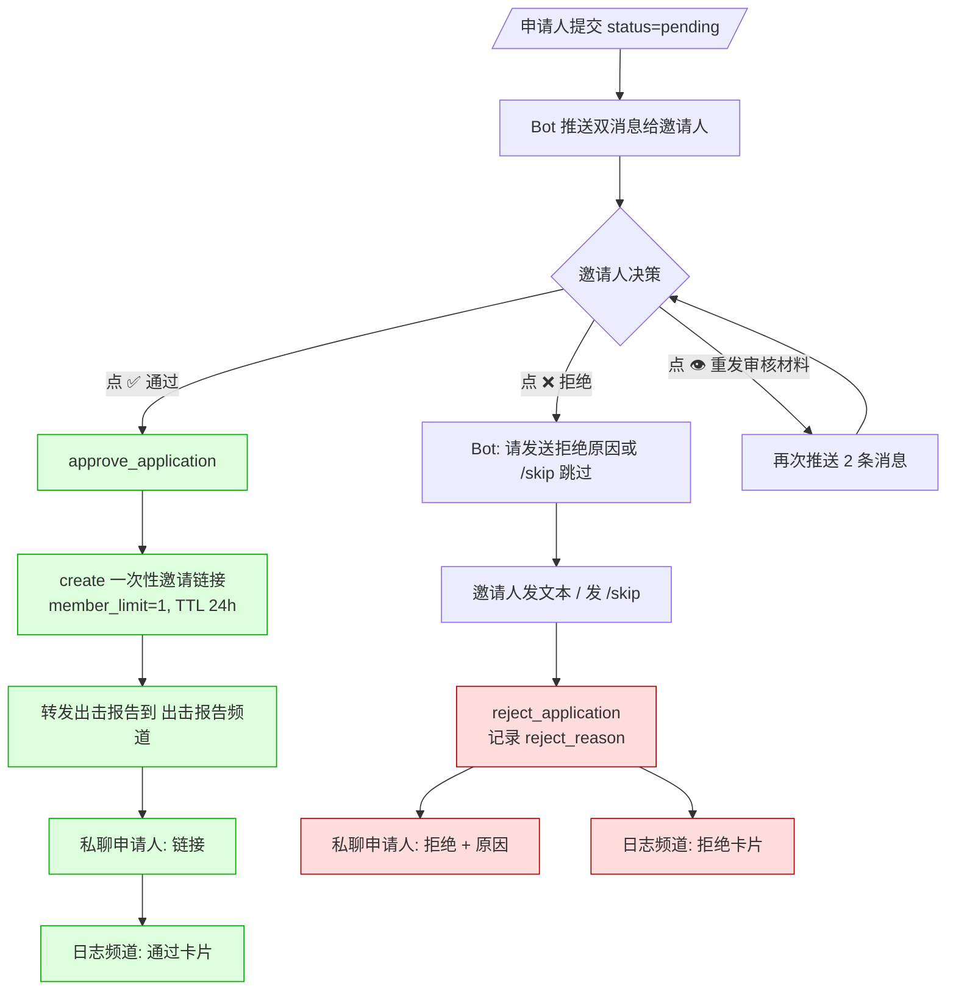

### 文案差异（acting vs others）

自审型只有 1 个审核者，所以"acting"和"others"在视觉上是同一个人。差异化文案的设计在代审型（§4）下才会展现。

### 拒绝原因输入流

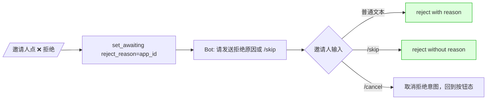

`awaiting_reject_reasons` 是进程内字典，重启即丢；丢了也不影响 —— 邀请人可重新点拒绝。

### 重发审核材料

`[👁 重发审核材料]` 永远可点（即使已通过/拒绝）。设计目的：邀请人在不同设备上重新看材料、或者把记录拍照外存。

---

## §4 管理员 · 代审型审核

代审型 = 申请提交后 Bot 广播给**所有管理员**（主+副，不区分超管），第一个点按钮的人获得审核权（行锁），其他人看到"已被处理"。

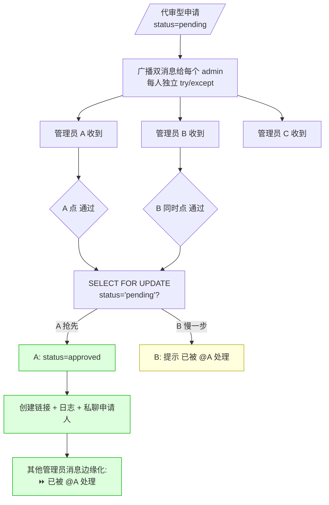

### acting vs others 差异化

| 视角 | 看到的消息 |
|---|---|
| acting（点中通过的管理员） | "✅ 您已通过此申请。已颁发链接：t.me/+ABC***" |
| others（其他管理员） | "⏩ 已被 @管理员A 处理" |
| acting（点中拒绝的管理员） | "❌ 您已拒绝。原因：xxx（acting 可见）" |
| others | "⏩ 已被 @管理员A 处理（不显示原因）" |

**关键**：拒绝原因仅对 acting 可见，**不外泄**给其他管理员（避免管理员之间互相反向打分）。

### 行锁说明

- **PostgreSQL**：`SELECT FOR UPDATE` 真实行锁；并发 2 个 update 第二个等待
- **SQLite（开发/测试）**：FOR UPDATE 是 no-op，但 SQLite 写串行化天然保护
- 测试用 FakeBot 模拟两个 session 串行调用 `approve`，第二个看到 `status≠'pending'` 自动失败

---

## §5 一次性链接 · 生命周期

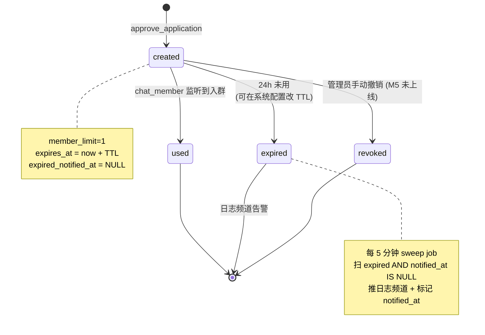

### 链接 URL 脱敏

日志频道展示链接时，前缀保留、后半段打码：

```
原链接：https://t.me/+ABCDEFGHIJKLMNO
显示：  https://t.me/+ABCD****
```

平衡可追溯（前缀可对）与防外泄（完整码不暴露）。

### TTL 配置

`/admin → [⚙️ 系统配置] → [✏️ 调整链接有效期]`，可改为 1–168 小时（clamp）。改完立即对**新链接**生效，旧链接保持原 TTL。

---

## §6 异常入群 · chat_member 监听

Bot 订阅 `CHAT_MEMBER` 更新，能感知用户实际进/出群。

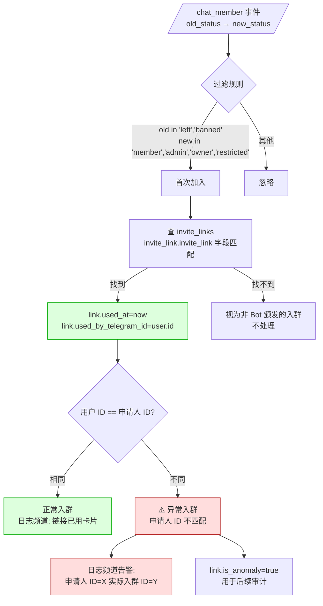

### 严格化的加入判定

只有 `old_status ∈ {left, banned} AND new_status ∈ {member, administrator, owner, restricted}` 才视为首次加入。`old=restricted → new=member` 不算（避免把"解除限制"误判为入群）。

### 异常入群常见场景

- 申请人把链接转发给别人 → 别人用了 → ID 不匹配
- 申请人 A 通过审核后用账号 B 入群（试图绕过）→ 触发告警

**告警仅记录、不自动处理**。管理员看日志频道决定是否手动踢出 + 加黑名单。

---

## §7 用户 · 回群密钥救济

申请人首次通过审核时会拿到一把**回群密钥**（一次性、argon2 哈希存储）。账号丢失/被封时凭密钥重新申请新链接。

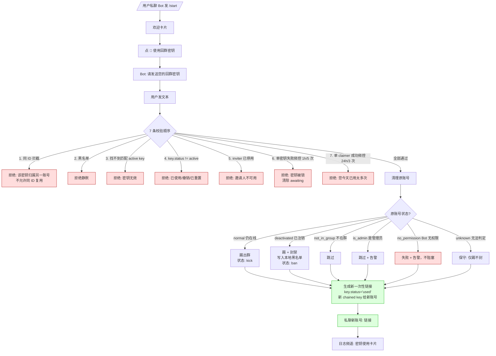

### 同 ID 拦截（最强规则）

如果当前账号 ID == 该密钥的 `owner_telegram_id`（即"还是原账号"），**直接拒绝**。设计目的：原账号没丢就不该用密钥。如果原账号真要重新入群，去找邀请人重新申请。

### 失败 vs 不可重试失败

| 类型 | 保留 awaiting? | 用户可改密钥重试? |
|---|---|---|
| 密钥无效（输错）| 是 | 是 |
| 密钥被锁（频控 6）| 否 | 1 小时后再来 |
| 同 ID 拦截（1）| 否 | 此密钥永远不能这个账号用 |
| 黑名单（2）| 否 | 你已被拉黑 |
| inviter 已停用（5）| 否 | 找管理员 |
| claimer 频控（7）| 否 | 24h 后再来 |

### chained key 链路

- 密钥用过即 `status='used'`，自动生成**新密钥**给新账号
- `chained_keys.owner_telegram_id` = 新账号 ID
- `chained_keys.original_owner_telegram_id` = 始终是首次申请人 ID（完整审计链）

### 清理动作表

```
原账号状态           cleanup_action  本地黑名单
─────────────────────────────────────────────
normal              kick           ❌
deactivated         ban            ✅（自动写入）
not_in_group        skip_not_in    ❌
is_admin            skip_admin     ❌
no_permission       failed         ❌
unknown             kick (safe)    ❌
```

> 💡 注销账号（`is_bot=False` 且 `first_name=''` 且无 username）一定永封 + 写本地黑名单。

---

## §8 申请人 · 报销申请

申请人通过入群审核后，可发 `/reimburse` 或点欢迎卡片的 `[💰 申请报销]`。

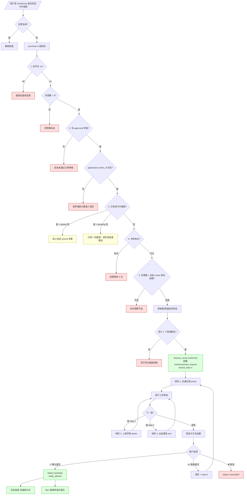

### 5 层预校验顺序

| # | 校验 | 失败文案 | 备注 |
|---|---|---|---|
| 1 | 总开关 on | 报销功能当前未启用 | 超管在 `[💰 报销管理]` 开 |
| 1b | 月预算 > 0 | 报销功能尚未配置完成 | 月预算 = 0 等于禁用 |
| 2 | 至少 1 个 `approved` application | 您尚未通过入群审核 | |
| 2b | application.inviter_id ≠ NULL | 该申请缺少邀请人信息 | 数据异常，找开发 |
| 3 | 没有进行中报销 | 已有一份报销 | 若是 wizard 态会续上 |
| 4 | 冷却时间已过 | 还需等待 X 天 | 默认 7 天，可按用户覆盖 |
| 5 | 月预算 ≥ inviter 档位金额 | 本月预算不足 | 等下月或调档位 |
| 6 | 资格群/频道至少在 1 个 | 您不符合报销资格 | 通过 `getChatMember` 检查；缓存 5 分钟 |

### 金额来源

- 申请人**不再选金额**（v1.0.0-beta.2 起）
- 金额由 `application.inviter.reimbursement_tier_cents` 决定（100/150/200 三档其一）
- 在 wizard 创建时**快照**到 `reimbursement_requests.amount_cents` —— 之后超管调档位不影响进行中/已发放的报销

### 续上 wizard

如果用户已经有 `status='wizard'` 的进行中报销，`/reimburse` 不会重启，会重新发送当前步骤的提示。设计目的：用户上次没传完，下次回来继续传。

---

## §9 管理员 · 报销审核 + 红包转发

报销提交后广播给**所有管理员**（与入群代审型同模式）。

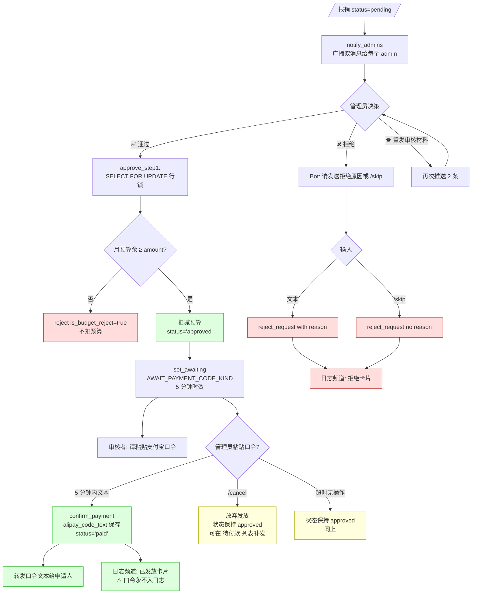

### 两阶段 approve

为什么不一次性 approve + 发放？因为审核通过 ≠ 发放完成 —— 管理员还得去支付宝复制口令再粘贴回 Bot。

- **Phase 1 (approve_step1)**：行锁 + 预算复检 + 扣减 + `status='approved'`。原子操作。
- **Phase 2 (confirm_payment)**：审核者粘贴口令，保存 + 转发申请人 + `status='paid'`。

两阶段拆开后，5 分钟过期或 `/cancel` 都不会脏数据 —— `approved` 状态可以由其他管理员补发（见下）。

### 补发口令路径

当 Phase 2 失败/超时 → 状态停在 `approved`。

```mermaid
flowchart LR
  Approved[/有 status=approved<br/>但未 paid 的报销/] --> AdminPanel[/admin → 💰 报销管理 → 💸 待付款]
  AdminPanel --> List[列表显示]
  List --> ClickResend[点 💸 补发口令]
  ClickResend --> ResetAwait[重置 AWAIT_PAYMENT_CODE 状态<br/>5 分钟时效重新计算]
  ResetAwait --> CodeInput[管理员重新粘贴口令]
  CodeInput --> Done[转发给申请人 → status='paid']

  classDef ok fill:#dfd,stroke:#0a0
  class Done ok
```

### 长报告降级

如果出击报告 > 1024 字符（Telegram media caption 上限），**自动降级**为：
1. 媒体组（无 caption）
2. 独立报告消息（纯文本）
3. 审核按钮消息

三条消息分别发送，审核者体验和单消息几乎一致。

### 拒绝原因外泄约束

与代审型入群审核同模式：
- acting reviewer 看到原因
- 其他管理员只看到"已被 @管理员A 处理"
- 申请人收到完整原因

### 口令永不入频道

`log_channel_service.push_reimbursement_event kind='paid'` 仅显示金额 + 审核人 + 申请人。**绝不**包含 `alipay_code_text`。这是硬约束（[REQ §8.5.12]）。

---

## §10 月预算 + 周报/月报

### 月预算重置（JobQueue）

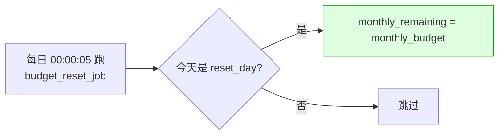

`reset_day` 默认 1（每月 1 号），可在 `[💰 报销管理] → [📋 系统配置]` 调（1–28 之间）。

### 周报 + 月报

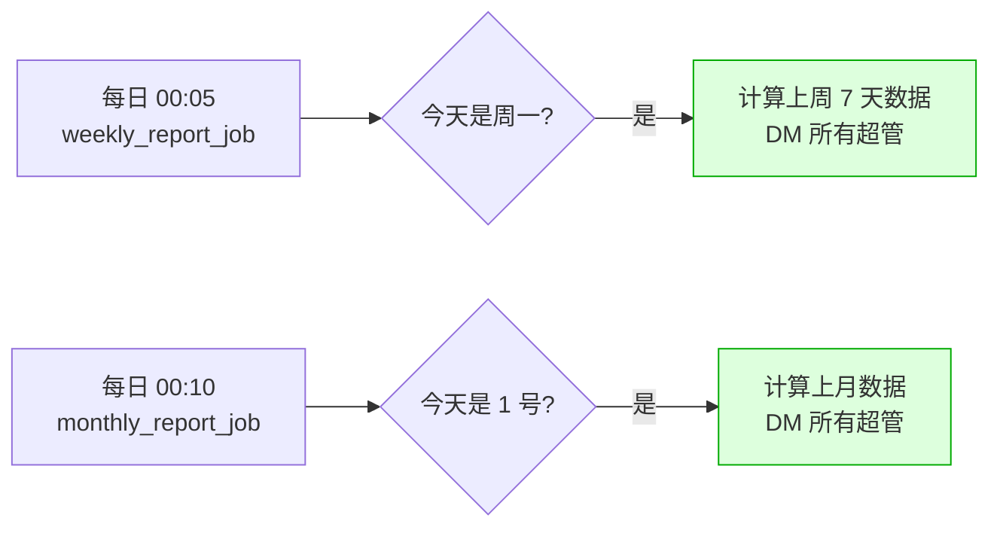

报表内容：
- 申请数 / 5 种状态分布
- 总发放金额（按 `paid_at` 归属）
- 月预算剩余
- 报销次数 Top 5 申请人

> 💡 时间窗口按本地 TZ 计算，但 SQL 查询用 UTC 边界 —— 避免跨天偏移。

### 内部判定 vs PTB 跨版本

`run_daily(days=(0,))` 在不同 PTB 版本行为有出入。本系统采用更稳的模式：每天都跑，job 内部 `should_run_weekly_today()` / `should_run_monthly_today()` 决定要不要真做事。

---

## §11 系统初始化清单

首次启动后由超级管理员完成，顺序见下图。

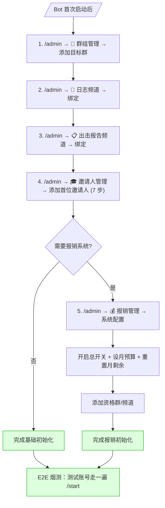

详细步骤见 [DEPLOYMENT.md §5](DEPLOYMENT.md#5-首次配置管理员侧)。

---

## §12 邀请人管理

`/admin → [🎓 邀请人管理]`

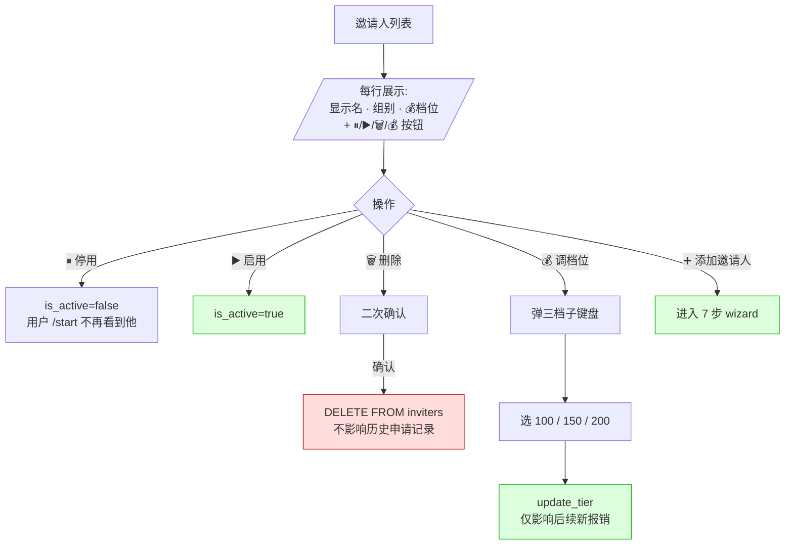

### 添加邀请人 7 步 wizard

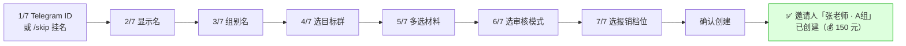

### 自审型 vs 代审型

| 模式 | 谁能审 | 适用场景 |
|---|---|---|
| 👤 自审型 | 仅该邀请人本人（必须有 Telegram ID） | 邀请人=老师，能自己看材料 |
| 🏢 代审型 | 所有管理员 | 挂名邀请人 / 老师不想/没时间审 |

挂名邀请人（没填 Telegram ID）**必须用代审型**，否则没人能审。

### 调档位不回溯

调档位仅影响后续**新创建**的报销 wizard。
- 进行中 wizard：amount_cents 是快照，不变
- pending：等审核，amount 不变
- approved/paid：已落，不变

---

## §13 黑名单

`/admin → [🚫 黑名单]`：拉黑后用户 `/start` 静默拒绝（既不响应也不报错）。

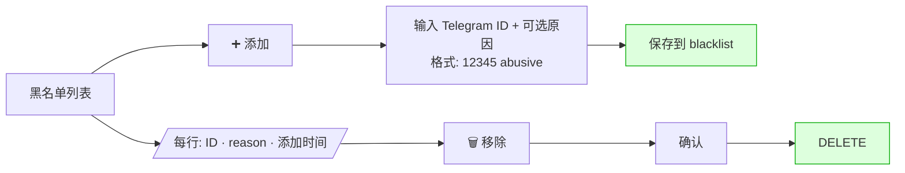

### 自动加入黑名单

某些路径会自动写本地黑名单：
- 回群密钥使用时原账号已注销 → reason="账号已注销，密钥使用后自动封禁"
- 异常入群告警目前**不**自动加，需管理员手动加（设计选择）

---

## §14 频道绑定

### 日志频道

`/admin → [📡 日志频道]`，6 类事件卡片：

| 事件 | 触发 | 包含字段 |
|---|---|---|
| 新申请 | wizard 提交 status=pending | 申请人 · 邀请人 · 提交时间 |
| 通过 | approve_application | 申请人 · 审核人 · 链接（脱敏）|
| 拒绝 | reject_application | 申请人 · 审核人 · 原因 |
| 链接已用 | chat_member 监听 | 申请人 · 实际入群人 · 是否异常 |
| 链接过期 | sweep job 5 min 一次 | 申请 · 链接 · 过期时间 |
| 密钥使用 | recovery_keys.status='used' | 密钥归属 · 清理动作 · 新账号 |
| 报销 5 状态 | new / approved / paid / rejected / budget_reject | 申请人 · 金额（不含口令）|

### 出击报告频道

`/admin → [📋 出击报告频道]`：仅在 `approve_application` 时**转发**申请人提交的出击报告文本（如果材料里有的话）。

每次尝试写一行 `attack_report_forwards`（即使 skipped 也写），便于审计："为什么这条没转发？" `status` 字段会给出原因。

---

## §15 主/副管理员管理 + 超管转让

`/admin → [👮 管理员管理]`（仅超管可见）

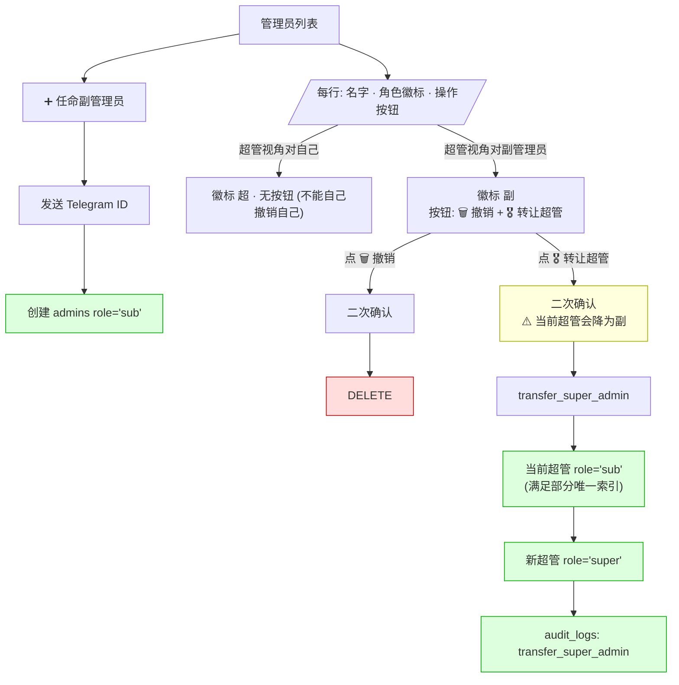

### 唯一超管约束

`uq_one_super_admin` 是 PostgreSQL 部分唯一索引：

```sql
CREATE UNIQUE INDEX uq_one_super_admin ON admins (role) WHERE role = 'super';
```

任何时候都只能有 0 或 1 个 super。Transfer 顺序故意先把 current_super 降级，再升级新人 —— 否则瞬时会有 2 个 super，触发约束冲突。

---

## §16 应急换超管

原超管账号丢失/被封时，无法点 `[🎖 转让超管]`（账号已不可用）。走 `.env` 强制覆盖。

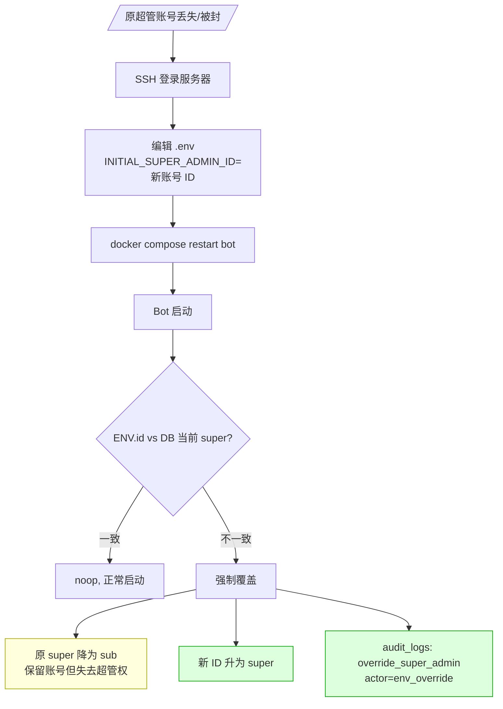

> ⚠️ 这是后门通道，需要 SSH 权限。请妥善管理服务器访问权限。

---

## §17 邀请人 · 个人面板 /panel

邀请人本人私聊 Bot 发 `/panel`，看自己接单统计。

```mermaid
flowchart TD
  Cmd[/邀请人发 /panel/] --> Check{是登记的邀请人?}
  Check -->|否| Friendly["未被登记 (静默不响应原命令)"]
  Check -->|是| Stats[stats_service.compute_inviter_stats]
  Stats --> Show[渲染面板]
  Show --> Sections["内容:<br/>· 接单总数 + 已决 + 通过率<br/>· 通过率 Top 10 (按总数排, 同总数按通过率)<br/>· 最近 10 条审核记录"]

  Show --> Action{操作}
  Action -->|👁 重发某条审核材料| Repost["权限校验: inviter_id 匹配?<br/>是 → 重发<br/>否 → 拒绝"]

  classDef ok fill:#dfd,stroke:#0a0
  class Stats,Show ok
```

### 通过率计算

`approval_rate = approved / (approved + rejected)` —— **不计** `pending` / `cancelled`，反映真实审核结果而非接单量。

### Top 10 排序

`(total desc, approval_rate desc)` —— 同总数下通过率高的排前面。截前 10 避免邀请人多时刷屏。

---

## §18 状态码与术语

### applications.status

| 值 | 含义 |
|---|---|
| `wizard` | 申请人正在 wizard 中，未提交 |
| `pending` | 已提交，待审核 |
| `approved` | 已通过 |
| `rejected` | 已拒绝 |
| `cancelled` | 申请人主动取消 |

### reimbursement_requests.status

| 值 | 含义 |
|---|---|
| `wizard` | wizard 中 |
| `pending` | 已提交，待审核 |
| `approved` | 已通过审核，等管理员发口令 |
| `rejected` | 已拒绝（含预算不足自动拒绝）|
| `cancelled` | 申请人主动取消 |
| `paid` | 已发放（口令转给申请人）|

### inviters.review_mode

| 值 | 含义 |
|---|---|
| `self` | 自审型 |
| `admin_delegated` | 代审型 |

### admins.role

| 值 | 含义 |
|---|---|
| `super` | 超级管理员（全局唯一）|
| `sub` | 副管理员（多人）|

### recovery_keys.status

| 值 | 含义 |
|---|---|
| `active` | 可用 |
| `used` | 已使用 |
| `revoked` | 已撤销（管理员主动）|
| `reset` | 已被用户主动重置（M5 占位，未上线）|

### recovery_keys.cleanup_action

| 值 | 含义 |
|---|---|
| `kick` | 已踢 |
| `ban` | 已踢 + 永封（注销账号专用）|
| `skip_not_in_group` | 跳过：不在群里 |
| `skip_admin` | 跳过：是管理员，不敢动 |
| `failed_no_permission` | 失败：Bot 无权限 |
| `pending` | 等待中（理论上不会停在这） |

### 报销系统 settings keys

| key | 默认 | 说明 |
|---|---|---|
| `reimbursement_global_enabled` | false | 总开关 |
| `reimbursement_monthly_budget_cents` | 0 | 月预算（分）|
| `reimbursement_monthly_remaining_cents` | 0 | 当前余额（分）|
| `reimbursement_budget_reset_day` | 1 | 每月哪天 00:00 重置（1–28）|
| `reimbursement_default_cooldown_days` | 7 | 默认冷却（1–90）|

### 报销档位（v1.0.0-beta.2 起）

| 常量 | 值（分）| 元 |
|---|---|---|
| `REI_TIER_100_CENTS` | 10000 | 100 元 |
| `REI_TIER_150_CENTS` | 15000 | 150 元 |
| `REI_TIER_200_CENTS` | 20000 | 200 元 |
| `REI_TIER_DEFAULT_CENTS` | 10000 | 100 元（新建邀请人默认）|

仅这三档允许；其他值会被 `inviter_repo.update_tier` 拒绝（`ValueError`）。

---

## 附录：常用命令速查

| 命令 | 谁能用 | 作用 |
|---|---|---|
| `/start` | 任何人 | 入口：申请入群 / 回群密钥 / 申请报销 |
| `/admin` | 管理员 | 管理面板 |
| `/panel` | 邀请人 | 个人统计面板 |
| `/reimburse` | 已通过审核的申请人 | 进入报销 wizard |
| `/cancel` | 任何场景 | 取消当前进行中的多步输入 |
| `/skip` | 邀请人添加/拒绝原因 | 跳过当前可选字段 |

---

## 附录：常见错误场景

| 场景 | 现象 | 处理 |
|---|---|---|
| 用户重复 `/start` | 续上 wizard 当前步骤，不重置 | 设计如此 |
| 用户从陈旧消息点按钮 | 按 DB 当前状态响应 | 设计如此 |
| 邀请人停用了但有 pending 申请 | 自审型卡住 | 临时切代审型，或重启 inviter |
| 邀请人未配档位（理论不会，default 100） | 报销金额按 100 元 | DB 兜底；可后续调 |
| 管理员粘贴口令超时 | 状态停 approved | 进 `[💸 待付款]` 补发 |
| 同 1 个 Telegram 账号既是邀请人又是申请人 | 行为冲突 | 不支持，业务上禁止 |
